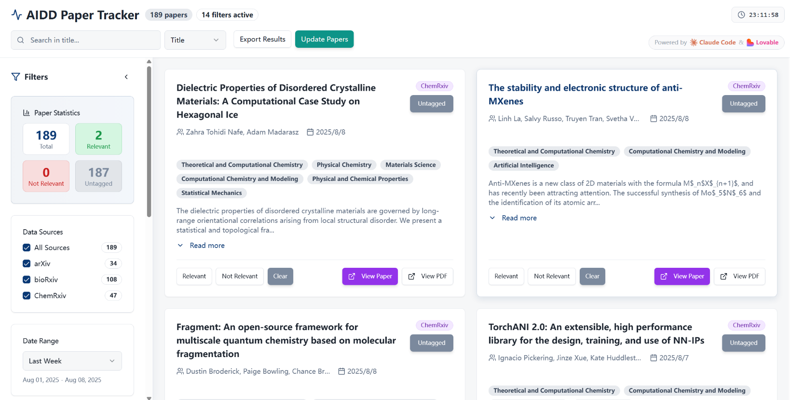

# AIDD Paper Tracker

**AIDD Paper Tracker** - A full-stack application system for tracking and managing AI drug discovery-related academic papers.

*Read this in other languages: [English](README.md), [中文](README-zh.md)*



## Overview

AIDD Paper Tracker is a specialized system for automated collection, management, and analysis of AI drug discovery-related academic papers. It integrates multiple preprint servers (arXiv, bioRxiv, ChemRxiv) and provides a modern web interface for browsing, filtering, and tagging paper relevance.

### Key Features

- **Automated Paper Retrieval**: Automatically fetch relevant papers from arXiv, bioRxiv, ChemRxiv
- **Intelligent Classification & Filtering**: Multi-dimensional filtering by source, category, date range, and keywords
- **Relevance Tagging**: Tag papers as relevant/irrelevant for further analysis
- **Modern Interface**: Responsive web interface built with React + TypeScript
- **Full-text Search**: Search keywords in titles, abstracts, and authors
- **Statistical Analysis**: Provide paper count and relevance statistics
- **Data Persistence**: SQLite database storage with JSON backup support

## Technology Stack

- **FastAPI**
- **React**
- **TypeScript**
- **Vite**
- **Tailwind CSS**
- **shadcn/ui**
- **SQLite**

## Data Sources
- **arXiv**: cs.LG, cs.AI, q-bio, physics.chem-ph categories
- **bioRxiv**: biochemistry, bioinformatics, biophysics, synthetic biology
- **ChemRxiv**: theoretical_computational, biological_medicinal

## Installation & Setup

### Prerequisites

- **Conda** (Miniconda or Anaconda) - [Download here](https://docs.conda.io/en/latest/miniconda.html)
- **Node.js 18+** - [Download here](https://nodejs.org/)
- **npm** (comes with Node.js)

### Quick Start

1. **Clone the repository**
   ```bash
   git clone https://github.com/xli7654321/AIDD-Paper-Tracker.git
   cd AIDD-Paper-Tracker
   ```

2. **One-click startup with conda environment** (Recommended)
   ```bash
   python run.py
   ```
   
   This enhanced script will automatically:
   - **Check for conda installation**
   - **Create conda environment** `aidd-tracker` with Python 3.10 (if not exists)
   - **Install Python dependencies** in the conda environment
   - **Check Node.js and npm availability**
   - **Install frontend dependencies**
   - **Create necessary directories** (data, logs)
   - **Start both backend and frontend servers**

3. **Access the application**
   - Frontend Interface: http://localhost:5173
   - Backend API: http://localhost:8000
   - API Documentation: http://localhost:8000/docs

### Manual Installation (Optional)

If you prefer to install and start services separately:

1. **Create and activate conda environment**
   ```bash
   conda create -n aidd-tracker python=3.10
   conda activate aidd-tracker
   ```

2. **Install Python dependencies**
   ```bash
   pip install -r requirements.txt
   ```

3. **Install frontend dependencies**
   ```bash
   cd frontend
   npm install
   cd ..
   ```

4. **Start backend service**
   ```bash
   cd backend
   python run_server.py
   ```

5. **Start frontend service** (in another terminal)
   ```bash
   cd frontend
   npm run dev
   ```

## Usage Guide

### Updating Paper Data

1. **Via Web Interface**
   - Click "Update Papers" button on the main interface
   - Select data sources to update (arXiv, bioRxiv, ChemRxiv)
   - Set date range and category filters
   - Click update to start data scraping

2. **Via API**
   ```bash
   curl -X POST "http://localhost:8000/papers/update" \
        -H "Content-Type: application/json" \
        -d '{
          "sources": ["arxiv"],
          "categories": ["cs.LG", "q-bio"],
          "start_date": "2025-06-01",
          "end_date": "2025-06-08"
        }'
   ```

## Project Structure

```
AIDD-Paper-Tracker/
├── backend/                    # FastAPI backend application
│   ├── main.py                # FastAPI main application
│   └── run_server.py          # Backend server startup script
├── frontend/                   # React frontend application
│   ├── src/
│   │   ├── components/        # React components
│   │   ├── pages/            # Page components
│   │   ├── services/         # API services
│   │   └── types/            # TypeScript type definitions
│   ├── package.json          # Frontend dependency configuration
│   └── vite.config.ts        # Vite build configuration
├── data/                      # Data storage directory
│   ├── papers.db             # SQLite database
│   └── papers.json           # JSON backup file
├── logs/                      # Log files directory
├── arxiv_fetcher.py          # arXiv data scraper
├── biorxiv_fetcher.py        # bioRxiv data scraper
├── chemrxiv_fetcher.py       # ChemRxiv data scraper
├── database.py               # Database management module
├── data_processor.py         # Data processing module
├── config.py                 # Configuration file
├── requirements.txt          # Python dependencies
├── run.py                    # One-click startup script
└── README.md                 # Project documentation
```

## Common Issues

1. **Port conflicts**: Ensure ports 8000 and 5173 are not in use
2. **Dependency issues**: Run `pip install -r requirements.txt` to reinstall dependencies
3. **Database errors**: Delete `data/papers.db` to let the system recreate it
4. **Network issues**: Ensure network connection is stable, some regions may require proxy for arXiv access

## License

This project is licensed under the [MIT License](LICENSE).

## Acknowledgments

The code of this project was developed primarily using Claude Code and Lovable. Thanks for their contributions.

---

*If you find this project helpful, please consider giving it a ⭐!*